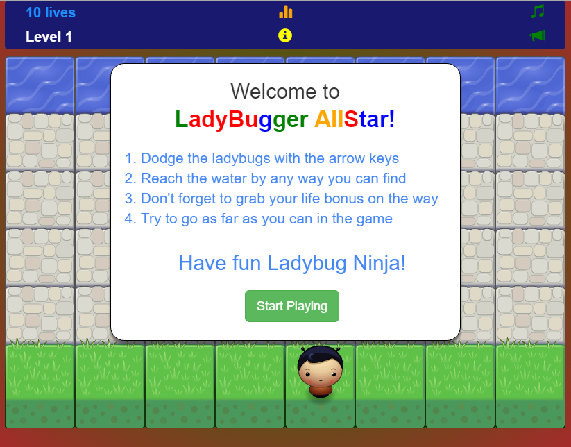

frontend-nanodegree-arcade-game
===============================

# Description
This is a project made for Udacity's frontend nanodegree. It is an arcade game that we were asked to develop to better integrate the Object-Oriented Programming (OOP) style of JavaScript. 
  
The __app.js__, __engine.js__, and __resources.js__ files were merged in __full.js__ and wrapped in a global function to avoid polluting the global scope. However, the code is identical between full.js and the three other js files.  

Link to the game: [http://michelmoreau.ca/ladybuggerallstar/](http://michelmoreau.ca/ladybuggerallstar/)
  
Game Previews:
  



# Getting Started
To play or test the game you just need to clone or download this git repository and open the index.html file through an http server.

``` 
git clone https://github.com/MichelML/frontend-nanodegree-arcade-game
```

Or, You can access it directly at [http://michelmoreau.ca/ladybuggerallstar/](http://michelmoreau.ca/ladybuggerallstar/)  

# Cool features
1. The canvas adjusts itself based on the size of the browser window
2. Cross-browser compatibility for recent versions of IE, Mozilla Firefox, Chrome, and Edge
3. Interesting gameplay although the first levels are quite easy (although it will depend on the size of your browser window - the bigger the window, the easier the game will be)  

# Areas for improvement
1. Allowing the user to select his/her character  
2. Allowing the player to register as a user and save his/her data for later games (through a database system)
3. Improving the design of the game  
4. Refactoring the code base
5. Implementing touch functionalities for touch-only devices  
6. Fixing the bug displaying an invisible bonus that the player can collect at Level 1

# Credits
1. All sounds of the game come from [https://www.freesound.org/](https://www.freesound.org/ "FreeSound.org")
2. The resources.js and engine.js file were coded by Udacity's team and I only made some minor adjustments 